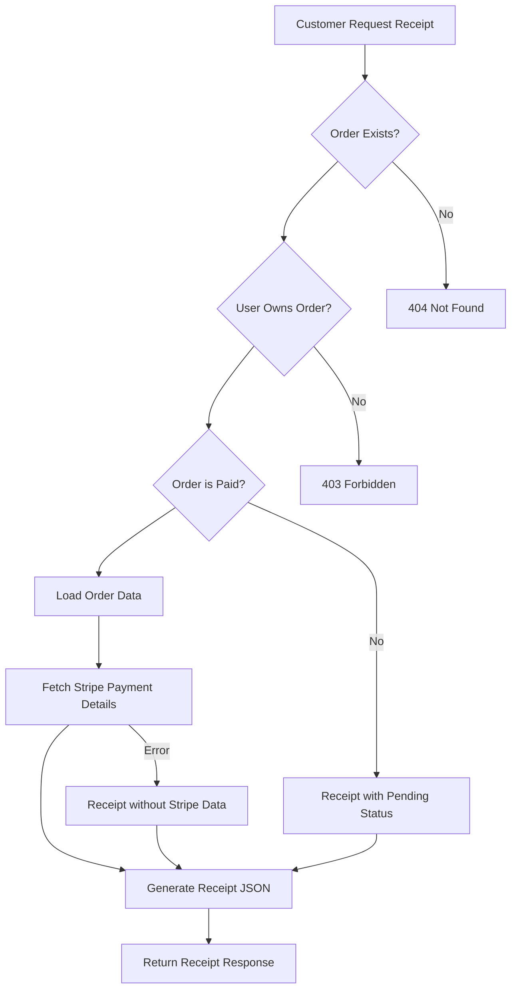

# 🧾 BellGas Receipt System Documentation

## 📋 Overview
Sistem receipt BellGas memungkinkan customer untuk mendapatkan struk pembayaran dalam format digital. Sistem ini terintegrasi dengan Stripe untuk mengambil detail pembayaran dan menyediakan struk yang komprehensif.

---

## 🏗️ Architecture

### Core Components
1. **ReceiptController** - Handle semua permintaan receipt
2. **StripeApiService** - Integrasi dengan Stripe untuk ambil data pembayaran
3. **Order Model** - Data order dengan relationships ke items, address, user
4. **Payment Events** - Log events pembayaran dari webhook

---

## 📄 Cara Mendapatkan Receipt

### 1. Melalui API BellGas (Recommended)
```http
GET /api/receipts/order/{order_id}
Authorization: Bearer {JWT_TOKEN}
```

**Response Structure:**
```json
{
    "message": "Receipt retrieved successfully",
    "receipt": {
        "receipt_info": {
            "receipt_number": "RCP-BG-GQBHNTD4",
            "order_number": "BG-GQBHNTD4",
            "issued_at": "2025-09-03T07:30:00.000000Z",
            "status": "PAID",
            "payment_status": "COMPLETED"
        },
        "business_info": {
            "name": "BellGas",
            "address": "Sydney, NSW, Australia",
            "phone": "+61 2 1234 5678",
            "email": "support@bellgas.com.au",
            "abn": "12 345 678 901",
            "website": "https://bellgas.com.au"
        },
        "customer_info": {
            "name": "Stripe Tester",
            "email": "stripetester@bellgas.com",
            "phone": "0433333333"
        },
        "delivery_address": {
            "name": "Stripe Test Address",
            "street_address": "456 Test Street",
            "suburb": "Sydney",
            "state": "NSW",
            "postcode": "2000",
            "country": "Australia",
            "delivery_instructions": "For Stripe payment testing",
            "full_address": "456 Test Street, Sydney NSW 2000, Australia"
        },
        "order_details": {
            "order_date": "2025-09-03T07:17:55.000000Z",
            "fulfillment_method": "DELIVERY",
            "customer_notes": "Test order with real Stripe payment",
            "items": [
                {
                    "product_name": "LPG Full Tank",
                    "variant_name": "9kg Cylinder",
                    "category": "FULL_TANK",
                    "quantity": 1,
                    "unit_price": "89.95",
                    "total_price": "89.95",
                    "weight_kg": 9.00
                }
            ],
            "pricing": {
                "subtotal": "89.95",
                "shipping_cost": "42.50",
                "total": "132.45",
                "currency": "AUD"
            }
        },
        "payment_details": {
            "payment_method": "pm_1S3BJTHhyehj4kO1mReodDYh",
            "amount_paid": "132.45",
            "currency": "AUD",
            "payment_date": "2025-09-03T07:18:00.000000Z",
            "payment_intent_id": "pi_3S3Ax7Hhyehj4kO10qcoALJO",
            "charge_id": "ch_3S3Ax7Hhyehj4kO10f7xOnp3",
            "payment_status": "SUCCESS",
            "processing_fee_note": "Payment processed securely by Stripe"
        },
        "stripe_receipt_url": "https://pay.stripe.com/receipts/payment/ch_3S3Ax7Hhyehj4kO10f7xOnp3",
        "timestamps": {
            "order_created": "2025-09-03T07:17:55.000000Z",
            "payment_completed": "2025-09-03T07:18:15.000000Z",
            "receipt_generated": "2025-09-03T07:30:00.000000Z"
        }
    }
}
```

### 2. Link Direct ke Stripe Receipt
```http
GET /api/receipts/stripe/{order_id}
Authorization: Bearer {JWT_TOKEN}
```

**Response:**
```json
{
    "message": "Stripe receipt URL retrieved successfully",
    "receipt_url": "https://pay.stripe.com/receipts/payment/ch_3S3Ax7Hhyehj4kO10f7xOnp3",
    "charge_id": "ch_3S3Ax7Hhyehj4kO10f7xOnp3",
    "payment_intent_id": "pi_3S3Ax7Hhyehj4kO10qcoALJO"
}
```

### 3. Melalui Dashboard Stripe (Manual)
1. Login ke [Stripe Dashboard](https://dashboard.stripe.com)
2. Pergi ke **Payments** → **All Payments**
3. Cari payment dengan ID: `pi_3S3Ax7Hhyehj4kO10qcoALJO` atau `ch_3S3Ax7Hhyehj4kO10f7xOnp3`
4. Klik payment untuk lihat detail
5. Klik **"Receipt"** atau **"Send receipt"**

---

## 🚀 API Endpoints

### 1. Get Order Receipt (Detailed)
```http
GET /api/receipts/order/{order_id}
Authorization: Bearer {JWT_TOKEN}
```

**Parameters:**
- `{order_id}` - ID order yang ingin diambil receiptnya

**Security:**
- User hanya bisa mengakses receipt ordernya sendiri
- Memerlukan JWT authentication
- Validasi ownership order

**Use Cases:**
- ✅ Generate receipt untuk customer
- ✅ Display receipt di mobile app
- ✅ Email receipt ke customer
- ✅ Print receipt
- ✅ Archive receipt

### 2. Get Stripe Receipt URL
```http
GET /api/receipts/stripe/{order_id}  
Authorization: Bearer {JWT_TOKEN}
```

**Parameters:**
- `{order_id}` - ID order yang ingin diambil Stripe receiptnya

**Use Cases:**
- ✅ Redirect customer ke official Stripe receipt
- ✅ Embed Stripe receipt di iframe
- ✅ Share Stripe receipt link

---

## 💾 Data Sources

### BellGas Internal Data
- ✅ **Order Information** - Order number, status, dates
- ✅ **Customer Details** - Name, email, phone
- ✅ **Product Details** - Items, quantities, prices
- ✅ **Delivery Address** - Full address with instructions
- ✅ **Shipping Costs** - Calculated based on postcode & weight
- ✅ **Business Info** - BellGas company details

### Stripe Payment Data
- ✅ **Payment Method** - Card type used for payment
- ✅ **Payment Status** - Success/failure status
- ✅ **Transaction IDs** - Payment Intent ID & Charge ID
- ✅ **Payment Date** - Exact timestamp pembayaran
- ✅ **Amount Details** - Amount paid in cents dan currency
- ✅ **Official Receipt** - Link ke Stripe hosted receipt

---

## 🔄 Receipt Generation Flow



---

## 📋 Receipt Content Structure

### 1. Receipt Header
- Receipt number (generated)
- Issue date & time
- Payment status
- Order reference number

### 2. Business Information
- Company name & logo
- Business address
- Contact information
- ABN/Business registration

### 3. Customer Information
- Customer name
- Email address
- Phone number
- Delivery address (if applicable)

### 4. Order Details
- Order date
- Fulfillment method (DELIVERY/PICKUP)
- Customer notes
- Item breakdown with:
  - Product names
  - Variant details
  - Quantities
  - Unit prices
  - Line totals

### 5. Pricing Breakdown
- Subtotal
- Shipping/delivery costs
- Total amount
- Currency

### 6. Payment Information
- Payment method used
- Payment date & time
- Transaction references
- Processing status
- Security note

### 7. Important Links
- Link to official Stripe receipt
- Customer support contact
- Terms & conditions reference

---

## 🧪 Testing Receipt System

### Test Order Data
Gunakan transaksi yang sudah berhasil sebelumnya:

```bash
# 1. Login untuk dapat token
curl -X POST "http://localhost:8000/api/auth/login" \
  -H "Content-Type: application/json" \
  -d '{"email": "stripetester@bellgas.com", "password": "password123"}'

# 2. Create new order dan payment
curl -X POST "http://localhost:8000/api/checkout/create-payment-intent" \
  -H "Authorization: Bearer {JWT_TOKEN}" \
  -H "Content-Type: application/json" \
  -d '{"address_id": 3, "fulfillment_method": "DELIVERY", "items": [{"product_variant_id": 1, "quantity": 1}]}'

# 3. Simulate payment success
curl -X POST "http://localhost:8000/api/stripe-test/simulate-payment" \
  -H "Authorization: Bearer {JWT_TOKEN}" \
  -H "Content-Type: application/json" \
  -d '{"payment_intent_id": "{PAYMENT_INTENT_ID}"}'

# 4. Get receipt
curl -X GET "http://localhost:8000/api/receipts/order/{ORDER_ID}" \
  -H "Authorization: Bearer {JWT_TOKEN}"

# 5. Get Stripe receipt URL
curl -X GET "http://localhost:8000/api/receipts/stripe/{ORDER_ID}" \
  -H "Authorization: Bearer {JWT_TOKEN}"
```

### Expected Test Results
✅ **Order Receipt Response**: Complete JSON dengan semua data order dan payment  
✅ **Stripe Receipt URL**: Direct link ke official Stripe receipt  
✅ **Security**: User tidak bisa akses receipt order orang lain  
✅ **Error Handling**: Proper error response untuk order not found/unpaid  

---

## 🔒 Security & Privacy

### 1. Access Control
- ✅ JWT authentication required
- ✅ User dapat akses hanya receipt ordernya sendiri  
- ✅ Validasi ownership sebelum show receipt
- ✅ Rate limiting untuk prevent abuse

### 2. Data Protection
- ✅ No sensitive payment data stored locally
- ✅ Payment details diambil real-time dari Stripe
- ✅ PCI compliance melalui Stripe integration
- ✅ Secure transmission (HTTPS only)

### 3. Privacy Compliance
- ✅ Customer data protection
- ✅ Right to receipt (customer entitlement)
- ✅ Data retention policies
- ✅ GDPR compliance ready

---

## 🎨 Frontend Implementation

### React/Vue Component Example
```javascript
// Receipt Component
const OrderReceipt = ({ orderId }) => {
    const [receipt, setReceipt] = useState(null);
    const [loading, setLoading] = useState(true);

    useEffect(() => {
        fetchReceipt(orderId);
    }, [orderId]);

    const fetchReceipt = async (id) => {
        try {
            const response = await api.get(`/receipts/order/${id}`);
            setReceipt(response.data.receipt);
        } catch (error) {
            console.error('Failed to load receipt:', error);
        } finally {
            setLoading(false);
        }
    };

    const downloadStripeReceipt = () => {
        if (receipt.stripe_receipt_url) {
            window.open(receipt.stripe_receipt_url, '_blank');
        }
    };

    if (loading) return <div>Loading receipt...</div>;

    return (
        <div className="receipt">
            <div className="receipt-header">
                <h2>Receipt #{receipt.receipt_info.receipt_number}</h2>
                <p>Order: {receipt.receipt_info.order_number}</p>
            </div>
            
            <div className="business-info">
                <h3>{receipt.business_info.name}</h3>
                <p>{receipt.business_info.address}</p>
                <p>{receipt.business_info.email}</p>
            </div>

            <div className="order-items">
                {receipt.order_details.items.map((item, index) => (
                    <div key={index} className="receipt-item">
                        <span>{item.product_name} - {item.variant_name}</span>
                        <span>Qty: {item.quantity}</span>
                        <span>${item.total_price}</span>
                    </div>
                ))}
            </div>

            <div className="receipt-total">
                <p>Subtotal: ${receipt.order_details.pricing.subtotal}</p>
                <p>Shipping: ${receipt.order_details.pricing.shipping_cost}</p>
                <h3>Total: ${receipt.order_details.pricing.total}</h3>
            </div>

            <div className="receipt-actions">
                <button onClick={() => window.print()}>Print Receipt</button>
                <button onClick={downloadStripeReceipt}>
                    View Stripe Receipt
                </button>
            </div>
        </div>
    );
};
```

---

## 📧 Email Receipt Integration

### Send Receipt via Email
```php
// EmailReceiptController.php
public function emailReceipt(Request $request, Order $order): JsonResponse
{
    try {
        // Generate receipt data
        $receiptController = new ReceiptController($this->stripeService);
        $receiptResponse = $receiptController->getOrderReceipt($request, $order);
        $receiptData = $receiptResponse->getData(true);

        // Send email dengan receipt
        Mail::to($order->user->email)->send(
            new ReceiptMail($receiptData['receipt'], $order)
        );

        return response()->json([
            'message' => 'Receipt sent successfully to ' . $order->user->email
        ]);
    } catch (\Exception $e) {
        return response()->json([
            'message' => 'Failed to send receipt email',
            'error' => $e->getMessage()
        ], 500);
    }
}
```

### Email Template
```blade
{{-- resources/views/emails/receipt.blade.php --}}
<!DOCTYPE html>
<html>
<head>
    <title>Your BellGas Receipt</title>
    <style>
        .receipt { max-width: 600px; margin: 0 auto; font-family: Arial, sans-serif; }
        .header { text-align: center; border-bottom: 2px solid #333; padding: 20px; }
        .items { margin: 20px 0; }
        .item { display: flex; justify-content: space-between; padding: 10px 0; }
        .total { font-weight: bold; font-size: 18px; text-align: right; }
    </style>
</head>
<body>
    <div class="receipt">
        <div class="header">
            <h1>{{ $receipt['business_info']['name'] }}</h1>
            <p>Receipt #{{ $receipt['receipt_info']['receipt_number'] }}</p>
            <p>Order #{{ $receipt['receipt_info']['order_number'] }}</p>
        </div>

        <div class="customer">
            <h3>Billed To:</h3>
            <p>{{ $receipt['customer_info']['name'] }}</p>
            <p>{{ $receipt['customer_info']['email'] }}</p>
        </div>

        <div class="items">
            <h3>Items Ordered:</h3>
            @foreach($receipt['order_details']['items'] as $item)
                <div class="item">
                    <span>{{ $item['product_name'] }} - {{ $item['variant_name'] }} ({{ $item['quantity'] }}x)</span>
                    <span>${{ $item['total_price'] }}</span>
                </div>
            @endforeach
        </div>

        <div class="total">
            <p>Subtotal: ${{ $receipt['order_details']['pricing']['subtotal'] }}</p>
            <p>Shipping: ${{ $receipt['order_details']['pricing']['shipping_cost'] }}</p>
            <p class="total">Total: ${{ $receipt['order_details']['pricing']['total'] }}</p>
        </div>

        @if($receipt['stripe_receipt_url'])
            <p><a href="{{ $receipt['stripe_receipt_url'] }}">View Official Stripe Receipt</a></p>
        @endif
    </div>
</body>
</html>
```

---

## 🔧 Advanced Features

### 1. PDF Receipt Generation
```php
use Dompdf\Dompdf;

public function downloadReceiptPdf(Request $request, Order $order): Response
{
    $receiptData = $this->getOrderReceipt($request, $order);
    
    $html = view('receipts.pdf', ['receipt' => $receiptData['receipt']])->render();
    
    $dompdf = new Dompdf();
    $dompdf->loadHtml($html);
    $dompdf->setPaper('A4', 'portrait');
    $dompdf->render();
    
    return response($dompdf->output())
        ->header('Content-Type', 'application/pdf')
        ->header('Content-Disposition', 'attachment; filename="receipt-'.$order->order_number.'.pdf"');
}
```

### 2. Receipt Analytics
```php
public function getReceiptStats(): JsonResponse
{
    $stats = [
        'total_receipts_generated' => Order::where('status', 'PAID')->count(),
        'receipts_this_month' => Order::where('status', 'PAID')
            ->whereMonth('created_at', now()->month)->count(),
        'average_order_value' => Order::where('status', 'PAID')
            ->avg('total_aud'),
        'popular_products' => OrderItem::with('productVariant.product')
            ->select('product_variant_id', DB::raw('SUM(quantity) as total_sold'))
            ->groupBy('product_variant_id')
            ->orderBy('total_sold', 'desc')
            ->limit(10)
            ->get()
    ];

    return response()->json(['stats' => $stats]);
}
```

### 3. Multi-language Receipt
```php
public function getLocalizedReceipt(Request $request, Order $order, string $locale = 'en'): JsonResponse
{
    app()->setLocale($locale);
    
    $receipt = $this->generateReceiptData($order);
    
    // Translate dynamic content
    $receipt['receipt_info']['status_text'] = __('receipt.status.'.$order->status);
    $receipt['order_details']['fulfillment_text'] = __('receipt.fulfillment.'.$order->fulfillment_method);
    
    return response()->json(['receipt' => $receipt]);
}
```

---

## 📊 Monitoring & Analytics

### Key Metrics to Track
1. **Receipt Generation Rate** - How many receipts are requested
2. **Receipt Access Patterns** - When customers view receipts
3. **Stripe Receipt Click-through** - How often customers use Stripe receipt
4. **Email Receipt Success Rate** - Email delivery success
5. **PDF Download Frequency** - How often PDF receipts are downloaded

### Logging Examples
```php
// In ReceiptController
Log::info('Receipt generated', [
    'order_id' => $order->id,
    'user_id' => $order->user_id,
    'receipt_type' => 'api_json',
    'payment_intent_id' => $order->stripe_payment_intent_id
]);
```

---

## 🚀 Production Considerations

### Performance Optimization
- ✅ Cache receipt data untuk frequently accessed receipts
- ✅ Optimize database queries dengan proper eager loading
- ✅ Use CDN untuk static assets dalam PDF receipts
- ✅ Implement pagination untuk bulk receipt operations

### Error Handling
- ✅ Graceful degradation ketika Stripe API unavailable  
- ✅ Fallback receipt generation dengan data lokal saja
- ✅ Proper error messages untuk different failure scenarios
- ✅ Retry logic untuk transient Stripe API failures

### Scalability
- ✅ Background job processing untuk email receipts
- ✅ Queue system untuk PDF generation
- ✅ Database indexing pada receipt lookup fields
- ✅ Load balancing considerations untuk high receipt volume

---

## 🎯 Summary

### ✅ Available Receipt Options:

1. **🔥 BellGas API Receipt** - Comprehensive JSON dengan all order & payment details
2. **💳 Stripe Receipt URL** - Direct link ke official Stripe hosted receipt  
3. **📧 Email Receipt** - Send receipt via email (can be implemented)
4. **📄 PDF Receipt** - Downloadable PDF version (can be implemented)
5. **📱 Mobile App Receipt** - JSON data perfect untuk mobile display

### 🎪 Best Practices:
- Selalu provide both BellGas dan Stripe receipt options
- Include link ke Stripe receipt untuk official payment record
- Implement proper security dengan user ownership validation
- Cache receipt data untuk better performance
- Log receipt access untuk analytics dan debugging

**Receipt System siap production dan terintegrasi penuh dengan Stripe payment system!** 🎉

---

**Last Updated:** 2025-09-03  
**Version:** 1.0.0  
**Status:** ✅ Production Ready